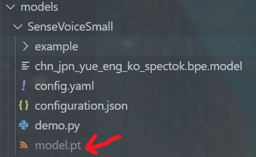
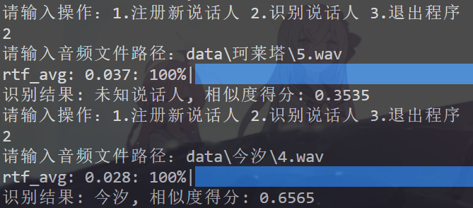

[](https://github.com/xinnan-tech/xiaozhi-esp32-server)

### 注意
本项目基于[小智ESP-32](https://github.com/xinnan-tech/xiaozhi-esp32-server)进行个人拓展，主要用于学习和研究目的。请勿用于商业用途或其他不当行为。

### 介绍
本项目在原来的基础上，添加了以下功能：
- 声纹识别
- 音频降噪
- 本地部署千问大模型qwen2.5:14b 

### 项目构建流程
#### 一、完整运行官方开源项目
将开源项目[小智ESP-32](https://github.com/xinnan-tech/xiaozhi-esp32-server)克隆到本地后，按照官方文档进行以下配置：

**1. 安装依赖库**
```bash
conda create -n xiaozhi-esp32-server python=3.10 -y
conda activate xiaozhi-esp32-server

conda install libopus -y
conda install ffmpeg -y
```

**2. 安装本项目依赖**
```bash
# 继续使用conda环境
conda activate xiaozhi-esp32-server
# 进入到你的项目根目录，再进入main/xiaozhi-server
cd main/xiaozhi-server
pip config set global.index-url https://mirrors.aliyun.com/pypi/simple/
pip install -r requirements.txt
```

**3. 下载模型文件**

这里只需要下载sensevoice的模型文件，大概八百多mb，下载完成后将model.pt文件放到`main\xiaozhi-server\models\SenseVoiceSmall`目录下。



**4. 配置.config.yaml文件**

按需修改即可，主要配置**STT、LLM和TTS**三部分。第一次使用需要申请chatllm的api key，但是本项目后来换成本地部署的千问大模型了，在此不赘述，后面会详细描述

#### 二、添加声纹识别功能
FunASR是一个语言识别工具箱，它可以使用SenseVoice这种语音转文字功能，也可以用来进行声纹识别。本项目采用`speech_campplus_sv_zh-cn_16k-common`模型进行声纹识别，该模型相较于其他有更快的推理速度，为主要用它来进行说话人确认。

**1. 测试声纹识别模型**

训练样本为四个人，每个人三段2-5秒的音频，将音频输入即可通过余弦相似度进行声纹匹配，声音越相似，余弦相似度越高。
如下图，未注册的人最高相似度未0.35，注册的人在0.65，测试了三十多组数据，模型准确率在90%以上。于是决定将其投入项目中去。


**2. 初次尝试为项目添加声纹识别逻辑**

声纹识别无非是对音频进行处理，显然我需要找到音频的位置。于是我在项目进行STT的时候查找音频，最终发现在`main\xiaozhi-server\core\providers\asr\fun_local.py`处存在音频的路径。
为了不破坏原有代码，我又新建了一个identify.py文件，专门用来进行声纹注册和识别。
    
```python
# 声纹注册和识别最核心的两行代码（传入音频路径和获取特征向量）
results = self.model.generate(input=[wav_path])
embedding = results[0]['spk_embedding']

def cosine_similarity(vec1, vec2):
    """计算两个向量的余弦相似度"""
    return np.dot(vec1, vec2) / (np.linalg.norm(vec1) * np.linalg.norm(vec2))
```

经过测试，效果相当不理想，完全达不到之前测试的90%以上准确率。最终发现是因为音频的采样率不同，导致特征向量的维度不一致。为了确保统一，所有注册、识别的音频都需要通过麦克风输入，对于输入的音频进行采样率转换，全部设为16kHz。
```python
with wave.open(file_path, "wb") as wf:
    wf.setnchannels(1)
    wf.setsampwidth(2)  # 2 bytes = 16-bit
    wf.setframerate(16000) # 16kHz
    wf.writeframes(b"".join(pcm_data))
```

**3. 声纹注册逻辑改进**

刚开始我准备直接提取用户的对话内容，若含有“注册”二字，则进行注册。经过测试，发现有些用户说话时会带有口音，导致模型无法识别出“注册”二字。

经过调研发现，大模型本身具有<strong>函数调用</strong>功能，大模型可以更准确的识别出“注册”二字，然后进行主动调用注册函数。于是我决定将大模型的函数调用功能与声纹注册结合起来。

这一过程<strong>相当复杂</strong>，本身大模型的函数调用就要写很多代码，在本项目中，整个函数调用部分分在了各个文件中，我需要找出所有函数调用的逻辑顺序，然后一一更改。

**这一块暂且不赘述，晚点写一份详细的文档。**

**1. 代码调用逻辑**
- 首先服务端接收语音指令后，首先调用意图处理intentHandler.py，该函数会进行意图分析和意图处理。
- 首先看看意图分析，会调用intent_llm.py文件，该文件写了prompt告诉LLM对用户内容进行分析
- 其次看看处理意图，这里还不是特别清楚，目前的理解是他会调用我们自己注册的意图函数

**2. 代码更改逻辑**
- 根据播放音乐的代码形式，在意图处理中添加声纹注册功能，这个功能需要调用我自己写的处理函数

- 编写意图分析
这里写prompt，告诉大模型返回固定内容

- 编写处理意图
通过conn.asr.save_audio_to_file(conn.asr_audio, conn.session_id)获取音频

**3. 获取正确的音频路径**
- 改进1：将声纹特征改为json格式和txt格式，可以更直接的看出到底有什么人注册了声纹，以及允许我对部分数据进行更改。
- 改进2：之前一直存在无法获取音频，后来仔细查看无论是否进行函数调用，都会运行asr模型也就是调用SST，这个文件里面会对麦克风收录的音频进行opus解码为wav。之后才会运行我们的函数调用，这个时候就不能再从conn中提取opus_data和session_id了，这也是为什么发现在注册声纹的函数中提取音频文件时回答是空白的原因。
- 解决2：由于fun_local文件已经保存了音频了，且命名方式为asr_latest_{session_id}.wav，那我只需要在注册函数中获取特定音频文件就可以了。

#### 三、本地部署大语言模型
首先选择的是deepseek-14b大语言模型，但他有两个很大的缺点：
- 需要深度思考，不适合及时对话
- 没有function calling功能

综合权衡后，选择千问大语言模型，千问大语言模型是一个开源的中文大语言模型，具有函数调用功能，适合本项目使用。

**1. 将千问大模型封装为api给小智ai调用**

本项目调用大模型只能提供API接口，不能直接调用本地部署的大模型。于是我将千问大模型封装为api接口，使用flask框架进行封装。将其包装为官方接口一模一样的格式。

本地部署后，千问大模型的确可以正常对话，但是封装api时出现了很多问题。我所做的封装方法如下：
- 标准的API路径：/v1/chat/completions
- 兼容的请求参数处理
- 规范的响应格式
- 标准化的流式响应机制

但是报错：
> ERROR-Error in function call streaming: 'ascii' codec can't encode characters in position 7-8: ordinal not in range(128)
原因：在处理API响应时，JSON序列化过程尝试将非ASCII字符（比如中文）编码为ASCII，这导致了编码错误。

以上错误是小智ai本身的代码问题，我自己封装的api都没有运行。找了很久的原因，始终没能发现问题所在。

**2. 基于Ollama本地部署千问大模型**

首先安装OLLama工具，这个工具可以很方便的将模型进行本地部署，linux下载命令：
    ```bash
    curl -fsSL https://ollama.com/install.sh | sh
    ```
下载前可以修改ollama模型下载的位置和访问位置，linux中编辑~/.bashrc来修改环境变量，最后面添加export OLLAMA_MODELS=/path/to/ollama/models即可修改位置，服务器迁移的时候要记得修改，不然找不到。

接着就是下载对应的模型，最简单的就是输入`ollama run qwen2.5:14b`。但是下载速度极慢，因此参考网上大佬的方法，模型刚开始下载快只是后来慢了，于是写一个自动脚本，下一会停一会。
    ```bash
    #!/bin/bash

    while true; do
        # 检查模型是否已下载
        if ollama list | grep "qwen2.5:14b" > /dev/null; then
            echo "models downloaded"
            break
        fi

        # 启动ollama进程
        echo "start download..."
        ollama run qwen2.5:14b &
        PID=$!

        # 等待60秒
        sleep 60

        # 尝试终止进程
        if kill -9 $PID 2>/dev/null; then
            echo "download interrupted, preparing to try again..."
        else
            echo "process already ended, no need to interrupt."
        fi
    done
    ```

运行ollama服务（输入命令ollama serve）后，使用ollama list可以查看有哪些模型，能看到部署的千问说明没问题。

上述操作没问题后，修改小智ai调用ollama模型，主要更改yaml配置文件：
- model_name: qwen2.5:14b 
- base_url: http://localhost:11434 

#### 四、基于SSH远程连接ESP32
**1. zerotier内网穿透**

首先是想通过zerotier进行内网穿透，但困难重重，暂且记录出现的问题吧
- `curl -s https://install.zerotier.com | sudo bash`：这是安装代码，没有出现问题，成功安装
- `sudo zerotier-one`：启动zerotier报错，权限警告、TUN/TAP 设备错误

```bash
failed to drop privileges (kernel may not support required prctl features), running as root
Starting Control Plane...
Starting V6 Control Plane...
ERROR: unable to configure virtual network port: could not open TUN/TAP device: No such file or directory
```
无法启动，后续所有操作都无法进行

**2. SSH远程连接**

通过ssh连接服务器，把远程服务器上的端口映射到本地局域网 IP 的指定端口。

可以使用如下命令：`ssh -L 192.168.162.159:本地端口:远程服务器IP:远程服务器端口 用户名@远程服务器IP`，可将远程服务器的端口映射到本地局域网 IP 的指定端口。
示例：
- 这是我的登录ssh指令，`ssh -p 38469 root@connect.cqa1.seetacloud.com`
- 这是我的本地IP端口：`192.168.162.159:8000`
- 这是服务器的IP端口：`172.17.0.13:8000`
- 最终启动的指令：`ssh -p 38469 -L 192.168.162.159:8000:172.17.0.13:8000 root@connect.cqa1.seetacloud.com`

**指令解释：**
- `-p 38469`：指定 `SSH` 连接所使用的端口号为 `38469。`
- `-L 192.168.162.159:8000:172.17.0.13:8000`：开启本地端口转发功能。简而言之，是把本地局域网 `IP 192.168.162.159` 的 `8000` 端口，和远程服务器上 `172.17.0.13` 的 `8000` 端口进行绑定。这样一来，当你访问本地 `192.168.162.159:8000` 时，实际访问的就是远程服务器上 `172.17.0.13:8000` 的服务。
- `root@connect.cqa1.seetacloud.com`：使用 `root` 用户登录到 `connect.cqa1.seetacloud.com` 这个远程服务器。

### 五、音频降噪
